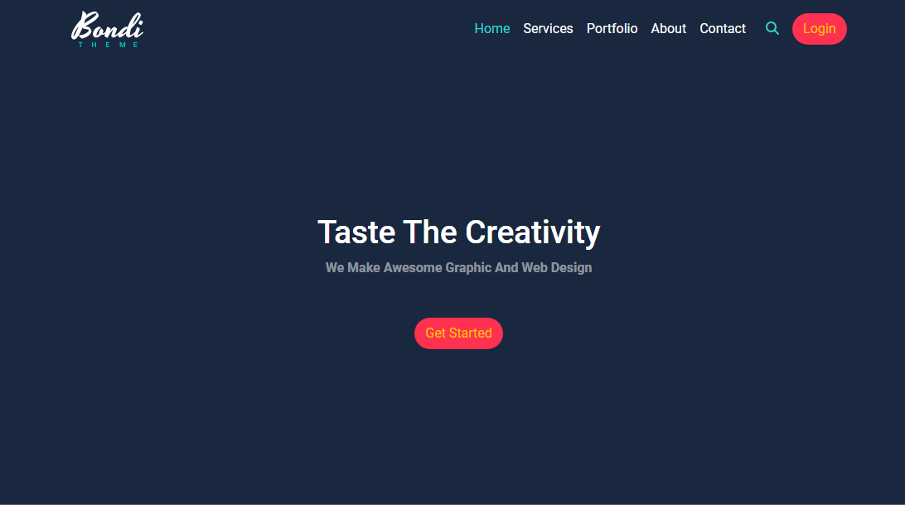
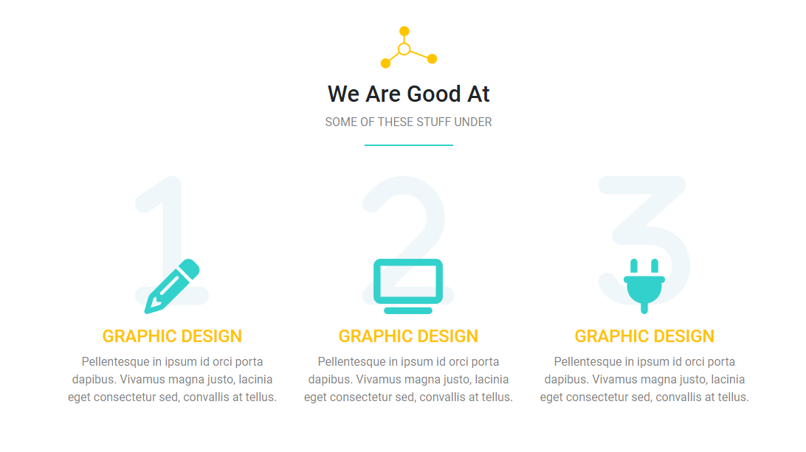
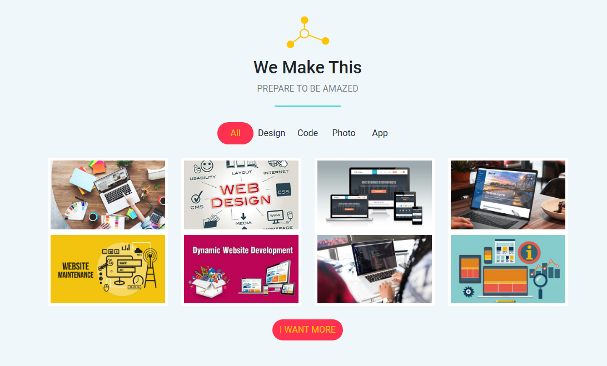
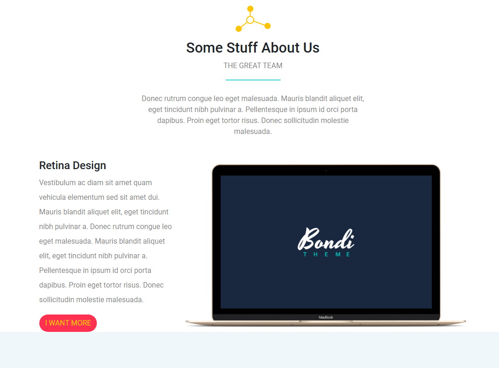
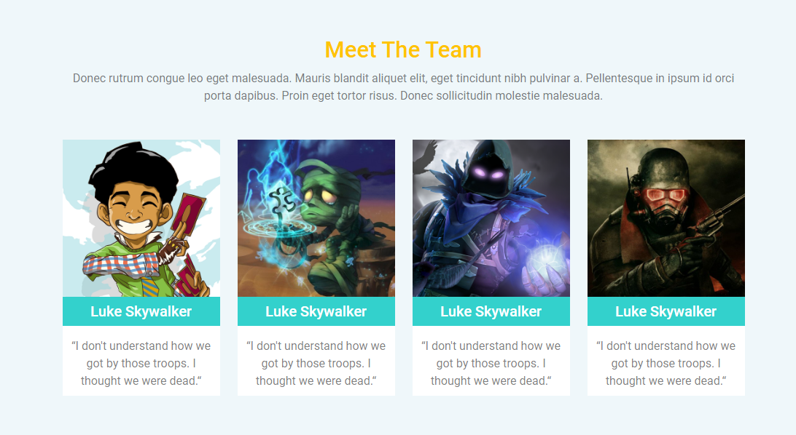
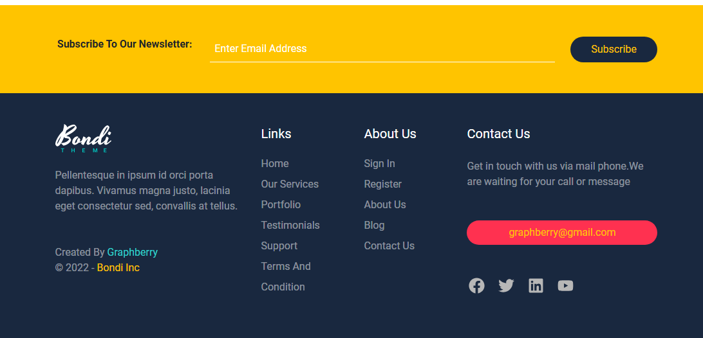

# Bondi Template

## What technology is used here?

I used Html, Css "Bootstrap", Fontawesome, Javascript.

## Template Review

### Landing

### We Are Good At "Services"

### We Make This Section

### About us Section

### Team Section

### Subscribe and Footer

## Links

- Facebook
  https://www.facebook.com/profile.php?id=100085749470017

- X
  https://twitter.com/ahmed_magdy135
